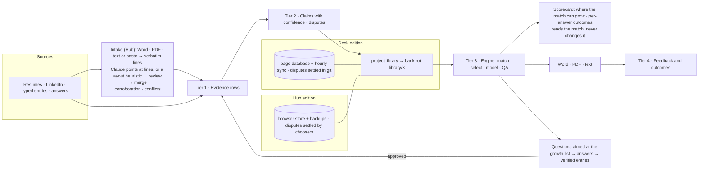

# Architecture

The maintained diagram is the Notion page [Career Companion Hub Architecture](https://app.notion.com/p/Career-Companion-Hub-Architecture-4d2447d2e7c7431e80b92d7f2a1ff97c). This page is the written form of the same picture, kept next to the code so it can be checked against it.

## The four tiers

Everything either edition knows sits in one of four tiers. Nothing moves up a tier without a step a person can see.

1. **Evidence** — verbatim lines with a source and a date: resume lines, LinkedIn text, typed entries, answers to questions. Append-only. Model output is never evidence.
2. **Derived knowledge** — claims drawn from evidence: a role's title and dates, an accomplishment's text and the numbers it states, a school, a certification, a tool. Each claim carries a confidence computed deterministically from its evidence (`core/rot_core.js` `confidenceFor`, the same formula as `claims.py`): the strongest source type, a small bonus per extra independent source type, verified at 1.0 when the person said it first-hand, disputed when two sources disagree and nobody has settled it.
3. **Generation** — the draft for one posting: requirements extracted from the posting, entries selected per role, the Skills and Tools lines ordered by relevance, the answers turned into entries. Every printed line names the claims behind it (`model.trace`), and a line may only state numbers its claims or the person's answer state (`qaLine`). A disputed number never prints.
4. **Feedback** — keep, drop and edit clicks, the outcome of each application. Recorded and reported; it adjusts ordering for the person, never rewrites a fact.

## The shared core

`core/rot_core.js` (RotCore, semver `VERSION`) is one classic script both pages load and `node --test` requires. It holds:

- `util`, `qa`, `score`, `doc` — text helpers, the number and first-person checks, coverage and match score, and the document builders (`docParagraphs` → Word XML, PDF, plain text) driven by a **layout** (`core/layouts/*.json`, rot-layout/1) that a template JSON carries.
- `createEngine(ctx)` — matching (`extractRequirements`), selection (`select`, `compute`), the resume model (`resumeModel`), placement of answer entries, template questions, digests, and `prompts` (tailor, bullets, tighten, summary: pure builders and parsers; the shells talk to Claude). With `settings.prompts.growth_list` the tailor prompt carries the ranked list of requirements not yet proven, so Claude's questions aim where the match can grow and phrase each "why" as a criterion, never a suggested answer (tailor@7, both editions).
- `claims.projectLibrary(backup, taxonomy)` — turns a `cch-backup/1` record into the bank (`rot-library/3`) the engine reads, with claims, confidence and disputes.
- `scorecard` — reads the match without changing it: `growth` (unproven requirements ranked by what proving each would add), `potential`, `headroom`, `toolsNamed` (tools an answer names that the Tools line lacks), `contributions` (what each answered question did, in question order), and the plain-language `EXPLAIN`. Both shells render it; nothing in it feeds back into coverage or the score.

Nothing personal is in `core/` or `hub/` (`tests/core/no_person.test.js`). The Desk keeps Tim's role keys, prompt persona and template in settings the bank exports (`baseline.settings`).

## Two editions, one flow

- **Desk**: evidence and claims are git JSON (`curation/`); `rot.py` exports the bank to `data/library.json`; the page reads it and writes runs, answers and feedback to its database; the hourly sync folds them back into git and re-exports.
- **Hub**: evidence, subjects and achievements live in the browser store (`hub/store.js`); `bank()` projects them on every change; intake (`hub/intake.js`) adds documents; answers fold into the record when a resume is downloaded; the person carries the record between devices as a backup file.

## Where the human step sits

Between tier 3 and tier 1 there is a gap no model crosses on its own: a draft can only be as true as the record, and the record only grows when a person states something and stands behind it. Both editions put the person there deliberately — five questions per posting, an answer that becomes an entry only after its numbers check out and the person approves it, a chooser whenever two documents disagree. That gap is what the project calls the **Empty Middle** (see the [glossary](glossary.md)): the tool drafts, the person owns the facts and the signature.

## Guarantees the tests hold

- `tests/parity/legacy_oracle.js --check`: 54 golden files (model, Word XML, text, parts) byte-identical across core changes for the Desk.
- `tests/parity/parity.py`: `rot.py` and the page build the same `.docx`, all 12 parts.
- `tests/core/*`, `tests/hub/*`, `tests/taxonomy/*`: the engine on a fictional person's bank (Riley Mahoney, `tests/fixtures/persona/`), the projection with its deliberate conflicts, the Hub store round-trip, the intake heuristic and merge over three resumes, the GTM taxonomy.
